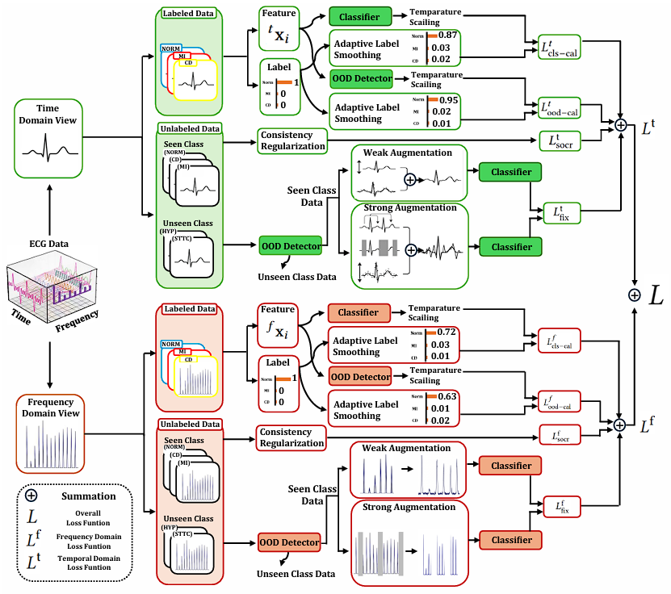

<h1 align="center">SafeECGMatch: Calibration-Aware Joint Frequency and Time
Space Semi-Supervised Learning for Open-Set ECG Classification</h1>

<p align="center">
  <strong>Hongkyu Koh</strong>
  &nbsp;&nbsp;
  <a href="https://scholar.google.com/citations?user=1rBh9xkAAAAJ">
    <strong>Ikbeom Jang</strong>
  </a><sup>†</sup>
  <br>
  <sup>†</sup> Corresponding author
</p>

<p align="center">
  
</p>

Official repository for the paper

**SafeECGMatch: Calibration-Aware Joint Frequency and Time
Space Semi-Supervised Learning for Open-Set ECG Classification**


## Abstract

Electrocardiogram (ECG) classification models often suffer from
severe label scarcity, making semi-supervised learning (SSL) an at-
tractive strategy for reducing annotation costs. In clinical settings,
however, unlabeled pools frequently contain out-of-distribution
(OOD) anomalies or diagnostic groups absent from the labeled
set. Standard SSL forces incorrect pseudo-labels onto these unseen
classes, producing overconfident predictions. To address this, we
propose SafeECGMatch, a calibration-aware safe SSL framework
for single-label ECG classification under label distribution mis-
match. Methodologically, SafeECGMatch employs a dual-branch
architecture extracting time-frequency latent representations via
ECG-specific augmentations. Crucially, it dynamically aligns confi-
dence with empirical accuracy through adaptive label smoothing
and temperature scaling, calibrating both the multiclass classifier
and the OOD detector across temporal and spectral domains. This
joint optimization allows trustworthy OOD rejection and reliable
pseudo-labeling. Evaluated on the PTB-XL and PhysioNet/CinC
Challenge benchmarks, SafeECGMatch achieves state-of-the-art
accuracy and calibration, advancing reliable knowledge discovery
in physiological time-series. 


## What Is Here

- `scripts/run_paper_benchmarks.py`: main entrypoint for the benchmark suites
- `scripts/preprocess_cinc2021.py`: CINC2021 preprocessing into the release-ready format
- `scripts/run_safeecgmatch_sensitivity.py`: SafeECGMatch branch-weight sensitivity runner
- `configs.py`, `datasets/`, `main/`, `models/`, `tasks/`, `utils/`: ECG runtime code used by the release
- `resources/cinc_labels/*.txt`: superclass label mappings used for CINC2021 preprocessing

The supported release surface is limited to ECG datasets (`PTB-XL`, `Chapman`, `Georgia`, `Ningbo`, `CINC2021`) with the `resnet1d` backbone.

## Dataset Download and Storage

Both PTB-XL and CINC2021 should be downloaded from their official PhysioNet releases.

- PTB-XL: download the official PTB-XL release and extract it locally.
- CINC2021: download the PhysioNet Challenge 2021 training data and keep the raw training directory locally.

Recommended local layout:

```text
/path/to/ecg-data/
  ptb-xl/
    1.0.3/
  challenge-2021/
    1.0.3/
      training/
  cinc2021_single_label_processed/
```

Path rules used by this release:

- `--ptbxl-root` should point to the extracted PTB-XL root, for example `/path/to/ecg-data/ptb-xl/1.0.3`.
- `--cinc2021-root` should point to the processed directory created by `scripts/preprocess_cinc2021.py`, not the raw Challenge directory.
- The exact storage location is up to the user. These paths do not need to match our server.

The smoke tests used during release preparation succeeded because these datasets were already available on this server. On another machine, the same commands will work as long as the user passes their own local dataset paths.

## Quick Start

### 1. Install

```bash
pip install -r requirements.txt
```

Extra preprocessing dependencies are already included in `requirements.txt`.

### 2. Choose Your Entry Point

- Use `scripts/run_paper_benchmarks.py` for the main paper benchmarks.
- Use `scripts/run_safeecgmatch_sensitivity.py` for the SafeECGMatch sensitivity study.
- Use `scripts/preprocess_cinc2021.py` only when you need to build the processed CINC2021 release dataset.

### 3. Run PTB-XL Benchmarks

```bash
python scripts/run_paper_benchmarks.py \
  --benchmarks ptbxl_30_ood ptbxl_60_ood \
  --ptbxl-root /path/to/ptb-xl/1.0.3
```

### 4. Run CINC2021 Benchmarks

Preprocess once:

```bash
python scripts/preprocess_cinc2021.py \
  --source-root /path/to/cinc2021/raw \
  --output-root /path/to/cinc2021_single_label_processed
```

Then run the benchmark suites:

```bash
python scripts/run_paper_benchmarks.py \
  --benchmarks cinc2021_30_ood cinc2021_60_ood \
  --cinc2021-root /path/to/cinc2021_single_label_processed
```

### 5. Run SafeECGMatch Sensitivity

```bash
python scripts/run_safeecgmatch_sensitivity.py \
  --variants freqheavy timeheavy \
  --ptbxl-root /path/to/ptb-xl/1.0.3
```

## Datasets

### PTB-XL

Pass the official raw PTB-XL root directly through `--ptbxl-root`.

Example root:

```text
/path/to/ecg-data/ptb-xl/1.0.3
```

### CINC2021

The release expects a processed CINC2021 directory produced by `scripts/preprocess_cinc2021.py`.

Workflow:

1. Download the raw Challenge 2021 training data.
2. Store it anywhere locally, for example `/path/to/ecg-data/challenge-2021/1.0.3/training`.
3. Run `scripts/preprocess_cinc2021.py` once.
4. Pass the resulting processed directory through `--cinc2021-root`.

Expected output structure:

- `metadata_single_label.csv`
- `data/{id}.npy`
- `preprocess_summary.json`

The preprocessing follows the ECGMatch superclass mapping and keeps only single-group samples. The special case `426783006` is treated as `Normal` only when it is the sole diagnosis code.

## Benchmark Suites

- `ptbxl_30_ood`: PTB-XL, 500 Hz, 30% OOD, full method suite
- `cinc2021_30_ood`: CINC2021, 500 Hz, 30% OOD, `TS_TFC` and `CompleMatch`
- `ptbxl_60_ood`: PTB-XL, 500 Hz, 60% OOD, `TS_TFC` and `CompleMatch`
- `cinc2021_60_ood`: CINC2021, 500 Hz, 60% OOD, `TS_TFC` and `CompleMatch`, with `cinc-id-classes = [Rhythm, CD, Other]` and `cinc-ood-classes = [Normal, ST]`

Legacy numeric aliases `05`, `06`, `07`, and `08` are still accepted, but the descriptive names above are the supported release interface.

Common options:

- `--seeds 1 2 3`: override the default seeds
- `--gpus 0`: choose GPU ids passed through to the training scripts
- `--dry-run`: print commands without executing them
- `--collect-only`: skip execution and only aggregate metrics from completed runs

Results are written under `checkpoints/` and aggregated summaries are written under `results/`.

## Sensitivity Variants

- `freqheavy`: `lambda-time-branch = 0.5`, `lambda-freq-branch = 1.5`
- `timeheavy`: `lambda-time-branch = 1.5`, `lambda-freq-branch = 0.5`

Both variants also use `lambda-ova-cali = 0.1` and `lambda-ova = 0.1` on top of the `ptbxl_60_ood` benchmark settings.

## Notes

- The release scripts do not require NAS-specific paths. Dataset roots are passed explicitly with CLI flags.
- The GitHub-facing entrypoints are the scripts under `scripts/`; most users should not need to call files under `main/` directly.
